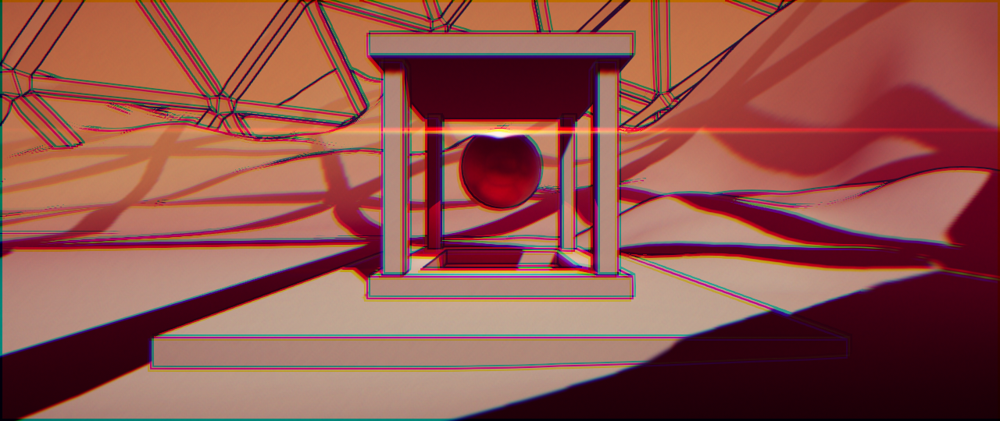
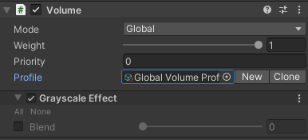

# Customizable Post-processing Stack for Universal Render Pipeline

This package adds the ability to create custom post-processing effects for the universal render pipeline in a manner similar to [PPSv2](https://github.com/Unity-Technologies/PostProcessing) and [HDRP's Custom Post Process](https://docs.unity3d.com/Packages/com.unity.render-pipelines.high-definition@8.2/manual/Custom-Post-Process.html). It is supposed to be a replacement for Unity's **PPSv2** till URP internally supports custom post-processing effect.

**Note:** You can add you custom effects in URP by inheriting from the `ScriptableRendererFeature` and `ScriptableRenderPass` classes. I personally find this to be hassle and that is why I wrote this package merely for convenience. I also took it as a chance to pick up the features I like from every post-processing solution I used for unity.

## System Requirements

* Unity 2020.1+
* URP 8.2.0+

## Features

* Conveniently add custom post processing effects similar to [PPSv2](https://github.com/Unity-Technologies/PostProcessing) (at least more convenient that writing a renderer feature and a render pass).
* Reorder effects from the editor similar to HDRP's [Custom Post Process Orders Settings](https://docs.unity3d.com/Packages/com.unity.render-pipelines.high-definition@8.2/manual/Custom-Post-Process.html#effect-ordering).
* Use legacy image effect shaders and unlit shader graphs if you wish (To be honest I didn't do anything, it worked out of the box so I added it to features list).
* Use `SceneNormals` feature (adapted from [Outline Study](https://github.com/chrisloop/outlinestudy) by [Christopher Sims](https://github.com/chrisloop)) to grab the scene normals on a texture.

Features that are almost untested:
* Compatible with MultiPass XR but it is tested with Mock HMD Loader only so I can't guarantee that it works on an actual headset.

## Known Issues

* It failed to work with Single-Pass Instanced Stereo Rendering. Actually, URP didn't work for me in this mode so I don't the reason behind this issue.
* The `SceneNormals` renderer feature uses the override material in the draw settings. This means that it doesn't not copy the parameters of the original material such as normal maps and alpha clipping. This should be solved in URP 10.0 with the release of the `DepthNormalsPass` made for the SSAO feature.

## Screenshots




The screenshots uses the following builtin effects:
* Tonemapping
* Vignette
* Film Grain
* Split Toning

For the custom effects, they contain the following:
* Edge Detection (Adapted from [this tutorial](https://halisavakis.com/my-take-on-shaders-edge-detection-image-effect/) by [Harry Alisavakis](https://halisavakis.com/)).
* Gradient Fog.
* Chromatic Splitting.
* Streak (Adapted from [Kino](https://github.com/keijiro/Kino) by [Keijiro Takahashi](https://github.com/keijiro)).

Other custom effects in samples but not used in screenshots:
* After Image.
* Glitch.
* Grayscale.
* Invert.

## How To Install

Follow the instructions from the Unity manual on [Installing from a Git URL](https://docs.unity3d.com/Manual/upm-ui-giturl.html) and insert the url: https://github.com/yahiaetman/urp-custom-pps.git then wait for the package to be downloaded and installed.

The package contains 8 example effect which are included as a sample. Samples can be imported from the package page in the package manager.

## Tutorial

First, we need a c# shader and a script for our custom effect. We will create a grayscale effect for the sake of simplicity.

First, lets create the C# script. We will call it `GrayScaleEffect.cs`. The name of the file must match the volume component class name to comply with Unity Serialization rules. In the file write the following:

```csharp
using UnityEngine;
using UnityEngine.Rendering;
using UnityEngine.Rendering.Universal;
using UnityEngine.Rendering.Universal.PostProcessing;

// Define the Volume Component for the custom effect 
[System.Serializable, VolumeComponentMenu("CustomPostProcess/Grayscale")]
public class GrayscaleEffect : VolumeComponent
{
    [Tooltip("Controls the effect strength")]
    public ClampedFloatParameter blend = new ClampedFloatParameter(0, 0, 1);
}

// Define the renderer for the custom post processing effect
[CustomPostProcess("Grayscale", CustomPostProcessInjectPoint.AfterPostProcess)]
public class GrayscaleEffectRenderer : CustomPostProcessRenderer
{
    // A variable to hold a reference to the corresponding volume component.
    private GrayscaleEffect m_VolumeComponent;

    // The postprocessing material.
    private Material m_Material;
    
    // The ids of the shader variables
    static class ShaderIDs {
        internal readonly static int Input = Shader.PropertyToID("_MainTex");
        internal readonly static int Blend = Shader.PropertyToID("_Blend");
    }
    
    // Whether the effect is visible in the scene view or not.
    public override bool visibleInSceneView => true;
    
    // Setup is called once so we use it to create our material
    public override void Setup()
    {
        m_Material = CoreUtils.CreateEngineMaterial("Hidden/PostProcess/Grayscale");
    }

    // Called once before rendering for each camera.
    // Return true if the effect should be rendered.
    public override bool SetupCamera(ref RenderingData renderingData)
    {
        // Get the current volume stack
        var stack = VolumeManager.instance.stack;
        // Get the corresponding volume component
        m_VolumeComponent = stack.GetComponent<GrayscaleEffect>();
        // if blend value > 0, then render this effect. 
        return m_VolumeComponent.blend.value > 0;
    }

    // The actual rendering execution is done here
    public override void Render(
        CommandBuffer cmd, 
        ref RenderingData renderingData, 
        RenderTargetIdentifier source, 
        RenderTargetIdentifier destination
    ){
        // set material properties
        if(m_Material != null){
            m_Material.SetFloat(ShaderIDs.Blend, m_VolumeComponent.blend.value);
        }
        // set source texture
        cmd.SetGlobalTexture(ShaderIDs.Input, source);
        // draw a fullscreen triangle to the destination
        CoreUtils.DrawFullScreen(cmd, m_Material, destination);
    }
}
```

As you can see, the code consists of two classes: the volume component and the renderer. The volume component only holds data and will appear as a volume profile option. The renderer is rensponsible for rendering the effect and read the effect parameters from the volume component. The volume component and renderer is decoupled from each other which opens up many options while implementing your effects. For example:
1. You can have a one-to-one relationship between your volume component and renderer (as we did above).
2. You can have a renderer without any corresponding volume component if it does not need any data from the volumes.
3. You can have a renderer that reads from multiple volume components (see [GrayAndInvertEffect.cs](Samples~/Examples/Scripts/PostProcessing/GrayAndInvertEffect.cs) as an example).
4. You can have multiple renderers read from the same volume component(s).

The option #3 is especially useful for writing uber effect shaders that can do multiple effects in the same blit to enhance performance.

Then we create the shader code. Create a shader file with any name you like (I prefer `GrayScale.shader`) and replace its content with the following code:

```glsl
Shader "Hidden/PostProcess/Grayscale"
{
    HLSLINCLUDE
    #include "Packages/com.yetman.render-pipelines.universal.postprocess/ShaderLibrary/Core.hlsl"
    #include "Packages/com.unity.render-pipelines.core/ShaderLibrary/Color.hlsl"

    TEXTURE2D_X(_MainTex);

    float _Blend;

    float4 GrayscaleFragmentProgram (PostProcessVaryings input) : SV_Target
    {
        UNITY_SETUP_STEREO_EYE_INDEX_POST_VERTEX(input);

        float2 uv = UnityStereoTransformScreenSpaceTex(input.texcoord);
        float4 color = LOAD_TEXTURE2D_X(_MainTex, uv * _ScreenParams.xy);
        
        // Blend between the original and the grayscale color
        color.rgb = lerp(color.rgb, Luminance(color.rgb).xxx, _Blend);
        
        return color;
    }
    ENDHLSL

    SubShader
    {
        Cull Off ZWrite Off ZTest Always
        Pass
        {
            HLSLPROGRAM
            #pragma vertex FullScreenTrianglePostProcessVertexProgram
            #pragma fragment GrayscaleFragmentProgram
            ENDHLSL
        }
    }
    Fallback Off
}
```

Since vertex shaders rarely contain any logic specific to the effect, we use a default vertex shader `FullScreenTrianglePostProcessVertexProgram` which is included in `Packages/com.yetman.render-pipelines.universal.postprocess/ShaderLibrary/Core.hlsl`. The fragment shader is the one reponsible for reading the original pixel color, calculating the grayscale color and blending the two colors together.

Now that we have our custom effect, we need to add a `CustomPostProcess` renderer feature to the foward renderer as seen in the next image. You can also add a `SceneNormals` renderer feature if you want to use scene normals in an effect (such as Edge Detection).


The `CustomPostProcess` renderer feature contains 3 lists that represent 3 injection points in the `ScriptableRenderer` as seen in the next image. The three injection points are:
* **After Opaque and Sky** where we can apply effects before the transparent geometry is rendered.
* **Before Post Process** which happens after the transparent geometry is rendered and before the builtin post processing is applied.
* **After Post Process** which happens at the very end before the result is blit to the camera target.

The ordering of the effects in a list is the same order in which they are executed (from top to bottom). You can re-order the effects as you see fit. **Note** that the effect must be added to the renderer feature to be rendered, otherwise, it will be ignored. So we added `GrayScale` to its list `After Post Process`.


Then we will create a volume in the scene (or use an existing volume) and add a `GrayScale Effect` volume component to it as seen in the next image.



Now you can override the `Blend` parameter and see the view becoming grayscale.


Other stuff we didn't explain but can be seen in the samples:
* Merge effects and read from more than one volume component (see [GrayAndInvertEffect.cs](Samples~/Examples/Scripts/PostProcessing/GrayAndInvertEffect.cs) and [GrayAndInvert.shader](Samples~/Examples/Resources/Shaders/PostProcessing/GrayAndInvert.shader)). 
* Create temporary render targets inside the renderer (see [StreakEffect.cs](Samples~/Examples/Scripts/PostProcessing/StreakEffect.cs)).
* Create persistent render targets inside the renderer (see [AfterImageEffect.cs](Samples~/Examples/Scripts/PostProcessing/AfterImageEffect.cs)).
* Use a shader graph `Unlit shader` to create a post processing effect (see [GlitchEffect.cs](Samples~/Examples/Scripts/PostProcessing/GlitchEffect.cs)).

## License
 [MIT License](LICENSE.md)